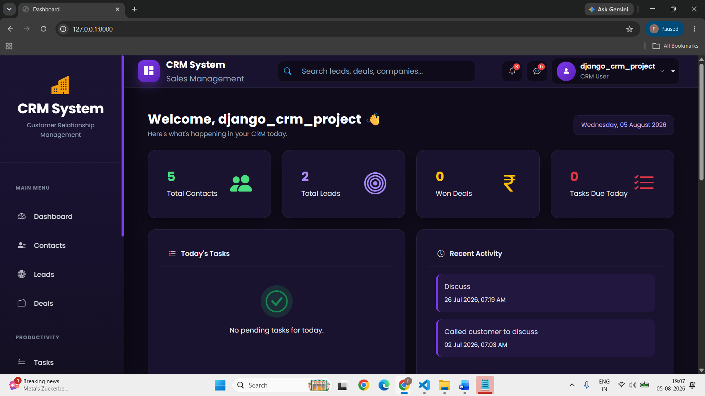
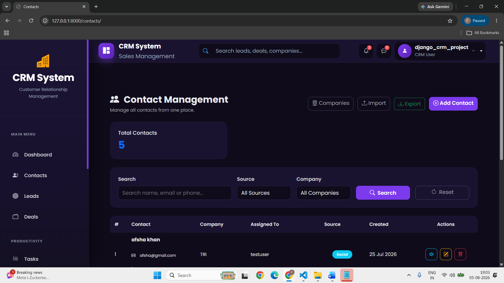
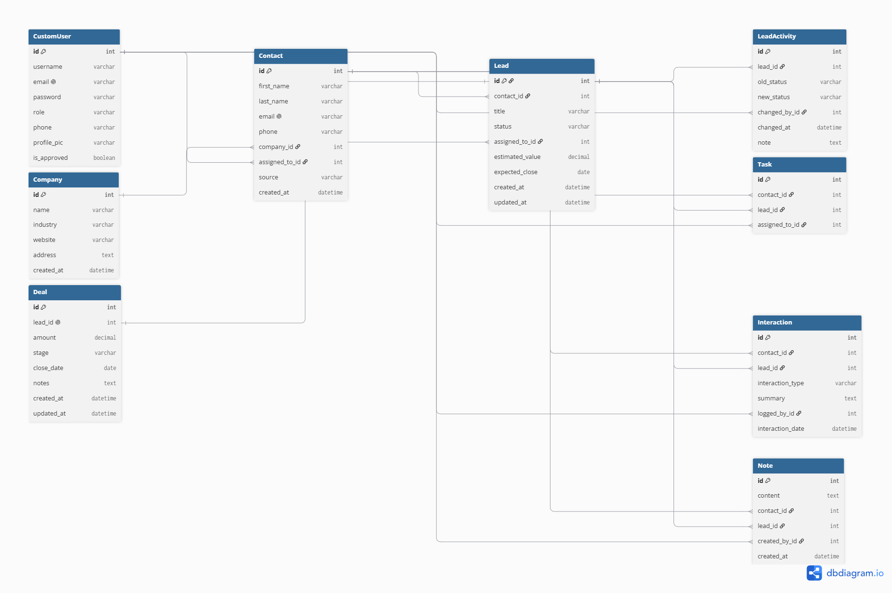

# Django CRM — Customer Relationship Management System

## Project Description

A full-featured Customer Relationship Management (CRM) system built with Django and MySQL. The system helps manage companies, contacts, leads, deals, tasks, interactions, and notes with role-based access for Admin and Agents.

## Features

* Role-based authentication (Admin / Agent)
* Company and Contact management
* Lead management with Kanban pipeline
* Lead status tracking and activity logging
* Deal tracking and management
* Task management
* Interaction and activity logging
* Notes management
* CSV import and export
* Dashboard with real-time statistics and charts
* Profile management
* Admin panel for user management
* Email functionality

## Tech Stack

* Python
* Django
* MySQL
* Bootstrap 5
* HTML5
* CSS3
* JavaScript
* Chart.js
* python-decouple
* Pillow

## Setup Instructions

### 1. Clone the repository

```bash
git clone YOUR_GITHUB_REPOSITORY_URL
cd django-crm-fiza
```

### 2. Create a virtual environment

```bash
python -m venv venv
```

### 3. Activate the virtual environment

**Windows:**

```bash
venv\Scripts\activate
```

**Mac/Linux:**

```bash
source venv/bin/activate
```

### 4. Install dependencies

```bash
pip install -r requirements.txt
```

### 5. Create the `.env` file

Create a `.env` file in the project root and add the required environment variables.

Use `.env.example` as a reference.

### 6. Create the MySQL database

Create a MySQL database named:

```text
crm_db
```

Then configure your database credentials in the `.env` file.

### 7. Run migrations

```bash
python manage.py makemigrations
python manage.py migrate
```

### 8. Create a superuser

```bash
python manage.py createsuperuser
```

### 9. Run the development server

```bash
python manage.py runserver
```

Open the project in your browser:

```text
http://127.0.0.1:8000/
```

## Screenshots

### Dashboard



### Lead Kanban Board


### Contact List



## ER Diagram



## Demo Video

[Watch Demo](YOUR_YOUTUBE_OR_DRIVE_LINK_HERE)
